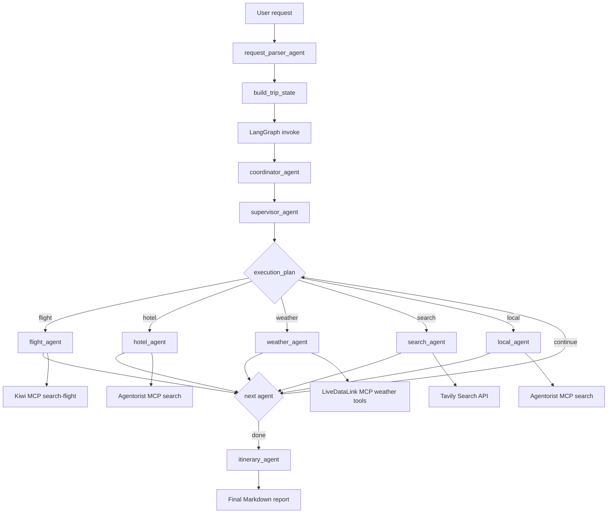

# Agentic Trip Planner

> An agentic AI travel planning system that coordinates specialized agents for flight discovery, hotel recommendations, weather analysis, destination research, and itinerary generation through a LangGraph-powered workflow.


Multi-agent travel planning using LangGraph, MCP integrations, and LLM-powered itinerary generation.

---

# Overview

The project demonstrates a multi-agent travel workflow built around LangGraph shared state. A user request is parsed into structured trip fields, then passed through specialist agents for flight search, hotel search, weather lookup, destination research, local discovery, itinerary generation, and final report formatting.

The workflow is exposed through a **FastAPI REST API** (`backend/api/app.py`), a **CLI** (`main.py`), and Python service functions (`services.trip_planner_service.plan_trip()`). Additional conversation helpers in `services.conversation_service` support multi-turn collection of missing required fields.

Main workflow:

1. Parse the user request into `origin`, `destination`, `travelers`, `venue`, and `event_date`.
2. Build a LangGraph-compatible `TripPlannerState`.
3. Run the compiled LangGraph workflow with SQLite checkpointing.
4. Execute a coordinator agent to validate state, then a supervisor agent to determine which specialist agents to run.
5. Call external MCP/API-backed tools for flights, hotels, weather, and search — skipping agents whose data is already available.
6. Generate an itinerary and assemble a final Markdown report.

# Architecture

The LangGraph workflow is defined in `graph/trip_graph.py`. It uses conditional agent routing based on the supervisor's execution plan with a SQLite checkpointer from `memory/sqlite_checkpoint.py`.



Execution flow:

| Step | Module | Purpose |
| --- | --- | --- |
| Request parsing | `agents/request_parser_agent.py` | Uses the Groq-backed LangChain agent to extract structured trip fields from natural language. |
| State creation | `utils/state_builder.py` | Normalizes parsed fields and initializes booking, pricing, and error fields. |
| Graph orchestration | `graph/trip_graph.py` | Routes agents conditionally based on the supervisor's execution plan and stores checkpoints in SQLite. |
| Agent execution | `agents/*.py` | Runs each specialist agent (coordinator, supervisor, flight, hotel, weather, search, local, itinerary) and appends results to shared state. |
| Report generation | `agents/itinerary_agent.py` | Calls `report_formatter_agent` internally to deterministically assemble the final Markdown report from state. |

# Features

- Natural-language request parsing into structured trip fields.
- Conditional LangGraph workflow — agents are skipped when data is already present via the supervisor's execution plan.
- SQLite-backed LangGraph checkpointing with generated thread IDs.
- Flight search through the Kiwi MCP `search-flight` tool.
- Hotel search through the Agentorist MCP `search` tool.
- Weather forecast and air quality lookup through LiveDataLink MCP tools.
- Destination research through Tavily web search.
- Local discovery search through the Agentorist MCP tool (`local_agent`).
- LLM-generated summaries for supervisor, flight, hotel, weather, search, and itinerary outputs.
- Deterministic final report formatting (no LLM) assembled by `report_formatter_agent`.
- Conversation service for collecting missing `origin`, `destination`, and `event_date` fields.
- FastAPI REST API with interactive Swagger/OpenAPI documentation at `/docs`.
- CLI entry point (`main.py`) for running trip plans from the command line.
- Request validation via Pydantic models (`backend/api/schemas/`).
- Structured logging with per-request correlation IDs.
- CORS middleware for web frontend integration.
- Resume interrupted trip workflows via API or service functions.
- Unit tests for state building, trip planning service behavior, and conversation state handling.
- Groq Whisper transcription helper in `config/models.py`.

# Project Structure

```text
trip_planner/
├── agents/
│   ├── conversation_agent.py
│   ├── coordinator.py
│   ├── flight_agent.py
│   ├── hotel_agent.py
│   ├── itinerary_agent.py
│   ├── local_agent.py
│   ├── report_formatter_agent.py
│   ├── request_parser_agent.py
│   ├── search_agent.py
│   ├── supervisor_agent.py
│   └── weather_agent.py
├── backend/
│   └── api/
│       ├── routes/
│       │   └── trips.py
│       ├── schemas/
│       │   ├── request.py
│       │   └── response.py
│       ├── app.py
│       └── log_config.py
├── config/
│   ├── models.py
│   └── settings.py
├── data/
│   ├── hotels_raw.json
│   └── weather_raw.json
├── graph/
│   └── trip_graph.py
├── memory/
│   └── sqlite_checkpoint.py
├── notebooks/
│   ├── mcp_connection_test.ipynb
│   └── trip_planner.ipynb
├── services/
│   ├── conversation_service.py
│   └── trip_planner_service.py
├── state/
│   └── trip_state.py
├── tests/
│   ├── test_conversation_service.py
│   ├── test_state_builder.py
│   └── test_trip_planner_service.py
├── tools/
│   ├── flight_tools.py
│   ├── hotel_tools.py
│   ├── tavily_search.py
│   ├── weather_mcp_client.py
│   └── weather_tools.py
├── utils/
│   ├── file_utils.py
│   └── state_builder.py
├── main.py
├── Procfile
├── requirements.txt
├── runtime.txt
└── README.md
```

Important files:

| Path | Purpose |
| --- | --- |
| `backend/api/app.py` | FastAPI application factory with CORS, logging middleware, and exception handlers. |
| `backend/api/routes/trips.py` | REST endpoints for trip planning, state retrieval, and checkpoint resumption. |
| `backend/api/schemas/` | Pydantic request/response models for validation and OpenAPI documentation. |
| `graph/trip_graph.py` | Builds and compiles the LangGraph workflow with conditional agent routing. |
| `state/trip_state.py` | Defines the shared `TripPlannerState` fields. |
| `services/trip_planner_service.py` | Provides `plan_trip()` and `resume_trip()` entry points used by CLI, API, and direct Python imports. |
| `services/conversation_service.py` | Provides multi-turn collection and resume helpers. |
| `config/settings.py` | Loads API keys, model names, MCP URLs, and directory settings from `.env`. |
| `config/models.py` | Creates Groq text and transcription clients. |
| `memory/sqlite_checkpoint.py` | Configures SQLite checkpoint persistence. |
| `tools/` | Contains wrappers for Kiwi MCP, Agentorist MCP, LiveDataLink MCP, and Tavily. |
| `main.py` | Command-line entry point for running trip plans. |
| `tests/` | Contains `unittest` coverage for service and state behavior. |

# Agent Responsibilities

| Agent | Inputs | Outputs |
| --- | --- | --- |
| `coordinator_agent` | Current trip state after parsing. | Validated required fields, initialized defaults, `status`. |
| `supervisor_agent` | Current trip state, required fields, prior agent outputs if present. | `supervisor_notes`, `execution_plan` (decides which agents to run), initialized state defaults, validation errors, `status` updates. |
| `flight_agent` | `origin`, `destination`, `event_date`, `travelers`. | `flight_details`, `flight_notes`, `flight_status`, `flight_booking_link`, `recommended_flight_price`. |
| `hotel_agent` | `destination`, `venue`, `event_date`, `travelers`, optional `budget` and `hotel_preferences`. | `hotel_details`, `hotel_notes`, `hotel_status`, `hotel_booking_links`, `hotel_price_details`. |
| `weather_agent` | `destination`, `event_date`. | `weather_details`, `weather_notes`, `weather_status`. |
| `search_agent` | `destination`, `venue`, optional `interests` and `trip_style`. | `search_results`, `search_notes`, `search_status`. |
| `local_agent` | `destination`, `venue`. | `local_results`, `local_notes`, `local_status`. |
| `itinerary_agent` | Destination details plus supervisor, flight, hotel, weather, search, and local notes. | `itinerary`, `itinerary_notes`, `itinerary_status`, `final_report` (via internal `report_formatter_agent` call), final `status`. |

Supporting agents (not part of the compiled LangGraph workflow):

| Agent | Current use |
| --- | --- |
| `request_parser_agent` | Called before graph execution to extract structured fields from user input. |
| `conversation_agent` | Used by `conversation_service` to detect missing required fields and select the next question (deterministic, no LLM). |
| `report_formatter_agent` | Called internally by `itinerary_agent` to deterministically assemble the final Markdown report from state — not a standalone graph node. |

# Technologies Used

| Category | Technology |
| --- | --- |
| Language | Python |
| Agent workflow | LangGraph |
| Agent framework | LangChain |
| LLM provider | Groq via `langchain-groq` |
| Text model default | `openai/gpt-oss-20b` |
| Transcription model default | `whisper-large-v3` |
| Search API | Tavily |
| Flight provider | Kiwi MCP server |
| Hotel/local provider | Agentorist MCP server |
| Weather provider | LiveDataLink MCP server |
| Checkpointing | LangGraph `SqliteSaver`, `langgraph-checkpoint-sqlite` |
| API framework | FastAPI, Uvicorn |
| Request validation | Pydantic |
| Database | SQLAlchemy, aiosqlite |
| Configuration | `pydantic-settings`, `.env`, `python-dotenv` |
| Testing | Python `unittest` |
| Notebook usage | Jupyter, IPython kernel |
| Data utilities | pandas, numpy |
| HTTP/MCP support | `requests`, `httpx`, `mcp` |

# Installation

The local virtual environment in this repository was observed running Python 3.13.7. The project does not currently pin a Python version in packaging metadata.

1. Clone the repository and enter the project directory:

```bash
git clone <repository-url>
cd trip_planner
```

2. Create and activate a virtual environment.

Windows PowerShell:

```powershell
python -m venv .venv
.\.venv\Scripts\Activate.ps1
```

macOS/Linux:

```bash
python -m venv .venv
source .venv/bin/activate
```

3. Install dependencies:

```bash
pip install -r requirements.txt
```

4. Create a `.env` file in the project root:

```env
GROQ_API_KEY=
TAVILY_API_KEY=
LANGCHAIN_TRACING=true
LANGCHAIN_API_KEY=
LANGCHAIN_PROJECT=TripPlanner
LANGCHAIN_ENDPOINT=https://api.smith.langchain.com
KIWI_MCP_SERVER_URL=https://mcp.kiwi.com
WEATHER_PROVIDER=livedatalink
WEATHER_MCP_SERVER_URL=https://livedatalink.ai/mcp
AGENTORIST_MCP_SERVER_URL=https://mcp.agentorist.com/mcp
```

5. Run the test suite:

```bash
python -m unittest discover tests
```

6. Start the FastAPI development server:

```bash
uvicorn backend.api.app:app --reload
```

The API is now available at `http://localhost:8000` with interactive Swagger documentation at `http://localhost:8000/docs`.

For deployment (Heroku), the included `Procfile` starts the server automatically:

```
web: uvicorn backend.api.app:app --host 0.0.0.0 --port $PORT
```

# Configuration

Configuration is loaded from `.env` by `config/settings.py`.

| Variable | Required | Default | Used by |
| --- | --- | --- | --- |
| `GROQ_API_KEY` | Yes | Empty | Text LLM and audio transcription clients. |
| `TAVILY_API_KEY` | Required for destination search | Empty | `tools/tavily_search.py`. |
| `LANGCHAIN_API_KEY` | Optional | Empty | LangSmith tracing, when configured. |
| `LANGCHAIN_TRACING` | Optional | `true` | Sets `LANGCHAIN_TRACING_V2`. |
| `LANGCHAIN_PROJECT` | Optional | `TripPlanner` | LangSmith project name. |
| `LANGCHAIN_ENDPOINT` | Optional | `https://api.smith.langchain.com` | LangSmith endpoint. |
| `GROQ_TEXT_MODEL` | Optional | `openai/gpt-oss-20b` | Chat model name. |
| `GROQ_TRANSCRIPTION_MODEL` | Optional | `whisper-large-v3` | Groq transcription model. |
| `KIWI_MCP_SERVER_URL` | Required for flights | `https://mcp.kiwi.com` | Kiwi MCP flight search. |
| `WEATHER_PROVIDER` | Optional | `livedatalink` | Weather provider label. |
| `WEATHER_MCP_SERVER_URL` | Required for weather | `https://livedatalink.ai/mcp` | LiveDataLink MCP weather tools. |
| `AGENTORIST_MCP_SERVER_URL` | Required for hotels | `https://mcp.agentorist.com/mcp` | Agentorist MCP hotel/local search. |
| `RECORDINGS_DIR` | Optional | `recordings` | File utility helpers. |
| `OUTPUTS_DIR` | Optional | `outputs` | Text report output helpers. |
| `LOGS_DIR` | Optional | `logs` | File utility helpers. |

Do not commit real API keys or service credentials.

# Example Usage

Run a complete planning request from Python:

```python
from services.trip_planner_service import plan_trip

result = plan_trip(
    "Plan a trip from Miami to New York for 2 travelers on 2026-08-15 "
    "visiting Madison Square Garden"
)

print(result["thread_id"])
print(result.get("final_report"))
```

Resume a graph checkpoint:

```python
from services.trip_planner_service import resume_trip

snapshot = resume_trip("trip_00000000000000000000000000000001")
print(snapshot["status"])
```

Use the multi-turn conversation service:

```python
from services.conversation_service import start_conversation, continue_conversation

start = start_conversation("Plan a trip to New York on 2026-08-15")
print(start["next_question"])

continued = continue_conversation(start["thread_id"], "Miami")
print(continued["status"])
```

Run a trip plan from the CLI:

```bash
python main.py --request "Plan a trip from Miami to New York for 2 travelers on 2026-08-15 visiting Madison Square Garden"
```

### API Usage

Start the FastAPI server, then use the REST API:

**Plan a trip using structured fields:**

```bash
curl -X POST http://localhost:8000/api/trips/plan \
  -H "Content-Type: application/json" \
  -d '{
    "origin": "MIA",
    "destination": "EWR",
    "event_date": "2026-08-15",
    "venue": "Prudential Center"
  }'
```

**Plan a trip using natural language:**

```bash
curl -X POST http://localhost:8000/api/trips/plan \
  -H "Content-Type: application/json" \
  -d '{
    "sentence": "I want to fly from Mumbai to Delhi on 2026-07-15 for a concert at the Dome."
  }'
```

**Health check:**

```bash
curl http://localhost:8000/api/trips/health
```

**Get trip state by thread ID:**

```bash
curl http://localhost:8000/api/trips/api_trip_a1b2c3d4e5f6
```

**Resume a trip from checkpoint:**

```bash
curl -X POST http://localhost:8000/api/trips/api_trip_a1b2c3d4e5f6/resume
```

Open `http://localhost:8000/docs` in a browser for the interactive Swagger UI.

Save a generated report to the configured outputs directory:

```python
from services.trip_planner_service import plan_trip
from utils.file_utils import save_text_output

result = plan_trip(
    "Plan a trip from Miami to New York on 2026-08-15 visiting Madison Square Garden"
)

path = save_text_output(result.get("final_report", ""))
print(path)
```

# Current Limitations

- Flight results depend on the availability and response format of the Kiwi MCP server.
- Hotel results depend on Agentorist MCP data; hotel pricing is limited to returned price categories unless the provider returns more detail.
- Weather forecast range is clamped to 1-16 days by `tools/weather_tools.py`.
- Air quality lookup failures do not fail the full weather request, but they are preserved in the weather result.
- Destination research requires `TAVILY_API_KEY`; missing or failing Tavily calls return empty results with an error.
- Agent summaries depend on Groq LLM responses and may fail if `GROQ_API_KEY` is missing or the provider is unavailable.
- Tests mock graph and parser behavior; they do not perform live MCP, Tavily, or Groq integration tests.
- The conversation service (`conversation_agent`) is fully deterministic and does not use an LLM.

# Development Notes

LangGraph state is defined as a `TypedDict` in `state/trip_state.py`. Each agent receives the current state dictionary, copies it, adds or updates its own fields, appends errors when needed, and returns the updated state.

Checkpointing is configured by `memory/sqlite_checkpoint.py`. By default, checkpoints are stored at `memory/trip_planner.db`, and service functions pass a generated `thread_id` through LangGraph's `configurable` configuration.

Agent orchestration is implemented in `graph/trip_graph.py` with the following edge order:

```text
START -> coordinator_agent -> supervisor_agent -> [conditional routing
        based on execution_plan] -> flight_agent | hotel_agent |
        weather_agent | search_agent | local_agent -> ... ->
        itinerary_agent -> END
```

Error handling is local to each agent. Tool or LLM failures are caught, a status such as `failed` or `degraded` is written into state, and a message is appended to the `errors` list. The workflow generally continues unless required validation fails in the supervisor.

The final report formatter (`report_formatter_agent`) does not call an LLM. It is invoked internally by the `itinerary_agent` graph node and assembles sections directly from the state, preserving specialist agent notes verbatim.

# Future Improvements

- Add live integration tests for MCP services and Tavily behind optional environment flags.
- Add structured schemas for external provider responses before LLM summarization.
- Add a license file.
- Add pinned dependency versions for repeatable installs.

# License

No license file is currently included in this repository. Add a license before distributing or accepting external contributions.
