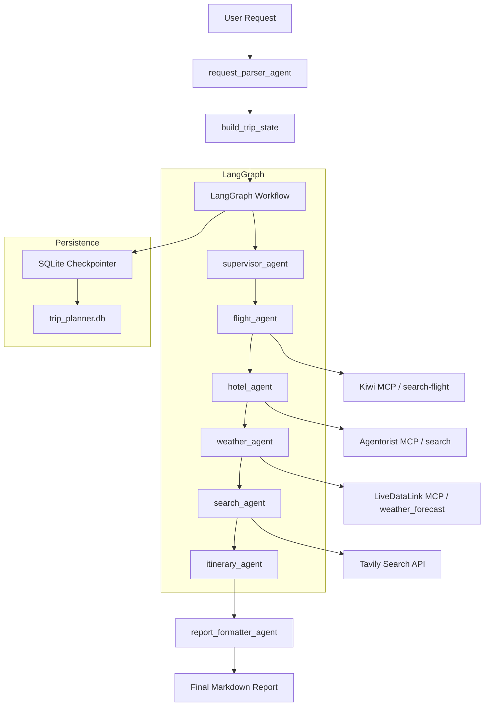
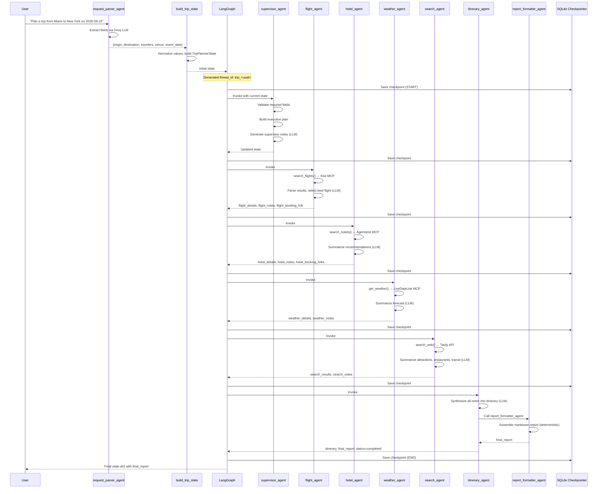
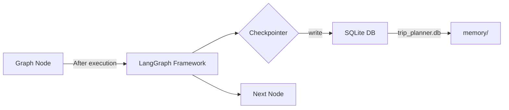
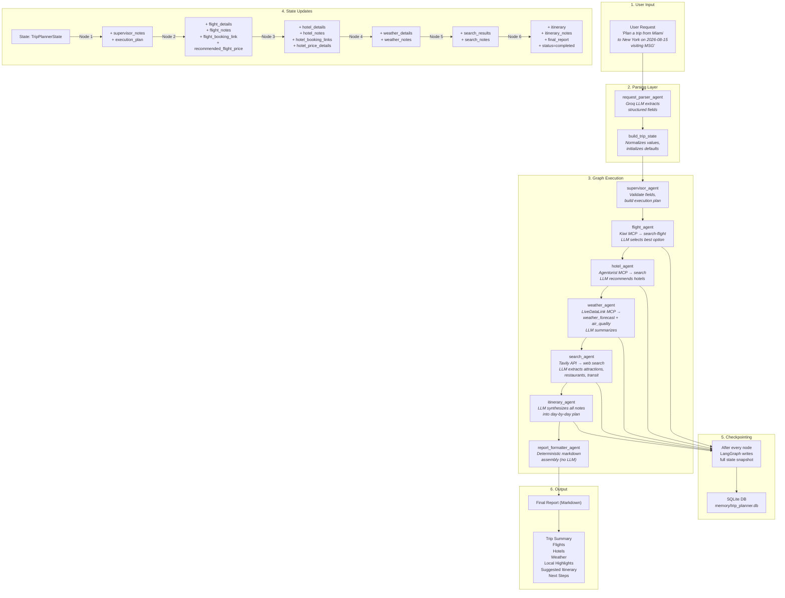

# System Design: Agentic Trip Planner

> A multi-agent travel planning system that coordinates specialized agents for flight search, hotel recommendations, weather analysis, destination research, and itinerary generation through a LangGraph-powered workflow.

---

## 1. Problem Statement

Planning a trip requires integrating information from multiple sources:

- **Flights**: Finding available routes, comparing prices, checking layovers, and obtaining booking links.
- **Hotels**: Discovering accommodations near the destination or venue, comparing ratings and price categories.
- **Weather**: Checking forecasts and air quality for the travel dates to inform packing and activity planning.
- **Local research**: Identifying attractions, restaurants, and transit options at the destination.
- **Itinerary generation**: Combining all of the above into a coherent, day-by-day travel plan.

Manually, this means visiting separate websites (Google Flights, Booking.com, Weather.com, TripAdvisor) and mentally synthesizing the results. The process is fragmented, time-consuming, and error-prone.

This system exists to consolidate those steps into a single natural-language request that produces a structured travel report.

---

## 2. Solution Overview

The system converts a natural-language travel request into a structured, multi-section travel report through a pipeline of specialized agents orchestrated by LangGraph.

```
User Request ("Plan a trip from Miami to New York on 2026-08-15")
        │
        ▼
  Request Parser Agent
  (extracts origin, destination, date, travelers, venue)
        │
        ▼
  State Builder
  (normalizes values, initializes TripPlannerState)
        │
        ▼
  LangGraph Workflow (sequential nodes)
        │
  ┌─────┼─────────┬──────────┬──────────┐
  ▼     ▼         ▼          ▼          ▼
Supervisor Flight  Hotel   Weather   Search
 Agent    Agent    Agent    Agent     Agent
  │        │        │        │         │
  └────────┴────────┴────────┴─────────┘
                   │
                   ▼
           Itinerary Agent
                   │
                   ▼
          Report Formatter Agent
           (deterministic, no LLM)
                   │
                   ▼
           Final Markdown Report
```

---

## 3. System Architecture



The graph is defined in `graph/trip_graph.py` as a `StateGraph` with a fixed linear topology. All six agent nodes execute sequentially; there is no conditional branching or parallel execution in the current implementation.

---

## 4. Agent Architecture

### 4.1 Agent Table

| Agent | File | Purpose | Inputs | Outputs | LLM Used |
|-------|------|---------|--------|---------|----------|
| **request_parser_agent** | `agents/request_parser_agent.py` | Extracts structured trip fields from natural language | User request string | `origin`, `destination`, `travelers`, `venue`, `event_date` | Yes |
| **supervisor_agent** | `agents/supervisor_agent.py` | Validates required fields, initializes state defaults, builds execution plan, provides summary notes | Current `TripPlannerState` | `supervisor_notes`, `execution_plan`, default state fields, `status` | Yes |
| **flight_agent** | `agents/flight_agent.py` | Calls Kiwi MCP flight search, selects best option, generates recommendation | `origin`, `destination`, `event_date`, `travelers` | `flight_details`, `flight_notes`, `flight_status`, `flight_booking_link`, `recommended_flight_price` | Yes (summary only) |
| **hotel_agent** | `agents/hotel_agent.py` | Calls Agentorist MCP hotel search, recommends hotels from structured results | `destination`, `venue`, `event_date`, `travelers`, optional `budget`/`hotel_preferences` | `hotel_details`, `hotel_notes`, `hotel_status`, `hotel_booking_links`, `hotel_price_details` | Yes (summary only) |
| **weather_agent** | `agents/weather_agent.py` | Calls LiveDataLink MCP weather forecast + air quality, summarizes for traveler | `destination`, `event_date` | `weather_details`, `weather_notes`, `weather_status` | Yes (summary only) |
| **search_agent** | `agents/search_agent.py` | Calls Tavily web search for destination research (attractions, restaurants, transit) | `destination`, `venue`, optional `interests`/`trip_style` | `search_results`, `search_notes`, `search_status` | Yes (summary only) |
| **itinerary_agent** | `agents/itinerary_agent.py` | Synthesizes all agent notes into a complete travel itinerary | All agent notes + supervisor notes | `itinerary`, `itinerary_notes`, `itinerary_status`, `final_report` | Yes |
| **report_formatter_agent** | `agents/report_formatter_agent.py` | Assembles final markdown report from state fields deterministically | Full `TripPlannerState` | `final_report` (markdown string) | No |

### 4.2 Supporting Agents

| Agent | File | Purpose | Status in Workflow |
|-------|------|---------|--------------------|
| **conversation_agent** | `agents/conversation_agent.py` | Deterministic helper for detecting missing fields and generating next questions | Used by `conversation_service.py` (pre-graph) |
| **local_agent** | `agents/local_agent.py` | LangChain agent with Agentorist `search_local_places` tool | Implemented, **not wired** into graph |
| **coordinator_agent** | `agents/coordinator.py` | State validation and initialization helper | Implemented, **not wired** into graph |

### 4.3 Agent Design Pattern

Every agent follows the same pattern:

1. Copy the incoming state dict (`updated_state = dict(state)`)
2. Copy the errors list (`errors = list(updated_state.get("errors") or [])`)
3. Execute its domain logic inside a try/except block
4. On success: write results into `updated_state` keyed by domain (e.g., `flight_details`, `flight_notes`, `flight_status`)
5. On failure: append error message to `errors`, set status to `"failed"`
6. Return `updated_state`

This shared-state pattern means every agent has access to every other agent's outputs. The LangGraph framework merges returned dict fields into the global state automatically.

---

## 5. Execution Flow



---

## 6. State Management

### 6.1 Shared State Pattern

The state is defined as a `TypedDict` in `state/trip_state.py`:

```python
class TripPlannerState(TypedDict):
    origin: str
    destination: str
    travelers: int
    venue: str
    event_date: str
    flight_details: dict
    flight_notes: str
    flight_status: str
    hotel_details: dict
    hotel_notes: str
    hotel_status: str
    weather_details: dict
    weather_notes: str
    weather_status: str
    search_results: dict
    search_notes: str
    search_status: str
    itinerary: str
    final_report: str
    itinerary_status: str
    supervisor_notes: str
    status: str
    errors: list[str]
    flight_booking_link: str
    hotel_booking_links: list[str]
    hotel_price_details: list[str]
    recommended_flight_price: float
    recommended_hotel_price: float
```

This is the **single source of truth** passed through every graph node. Each agent reads the fields it needs from this state and writes its own domain fields back.

### 6.2 State Flow Diagram

```mermaid
flowchart LR
    subgraph Initialization
        A[Parsed Request] --> B[build_trip_state]
        B --> C[TripPlannerState]
    end

    subgraph Agent Pipeline
        C --> D[supervisor_agent]
        D -->|adds supervisor_notes, execution_plan| E[Updated State]
        E --> F[flight_agent]
        F -->|adds flight_*, recommended_flight_price| G[Updated State]
        G --> H[hotel_agent]
        H -->|adds hotel_*, hotel_price_details| I[Updated State]
        I --> J[weather_agent]
        J -->|adds weather_*| K[Updated State]
        K --> L[search_agent]
        L -->|adds search_*| M[Updated State]
        M --> N[itinerary_agent]
        N -->|adds itinerary, final_report, status=completed| O[Final State]
    end
```



### 6.3 Agent Updates

Each agent receives the full state and returns a partial dict of fields it wants to update. LangGraph's `StateGraph` merges these partial updates into the global state using the reducer pattern (default is overwrite).

### 6.4 Error Collection

Errors are collected in `state["errors"]` as a list of strings. Each agent appends its own error messages prefixed with the agent name (e.g., `"flight_agent failed: ..."`). The workflow continues even if individual agents fail, unless the supervisor detects missing required fields (destination, venue, event_date).

### 6.5 Checkpointing



Checkpointing is provided by `langgraph.checkpoint.sqlite.SqliteSaver`, configured in `memory/sqlite_checkpoint.py`. After every node execution, the full state is persisted to a local SQLite database at `memory/trip_planner.db`. This enables:

- **Resumability**: A failed workflow can be resumed from the last checkpoint using `resume_trip(thread_id)`.
- **Inspection**: State can be examined mid-workflow via `get_state()`.
- **Multi-turn conversations**: The conversation service saves and loads state across turns.

---

## 7. External Integrations

### 7.1 Integration Table

| Integration | Provider | Tool File | Protocol | Purpose | Data Returned |
|-------------|----------|-----------|----------|---------|---------------|
| **Flight Search** | Kiwi.com | `tools/flight_tools.py` | MCP (SSE/Streamable HTTP) | Search available flights | Flight routes, prices, departure/arrival times, layovers, booking links |
| **Hotel Search** | Agentorist | `tools/hotel_tools.py` | MCP (SSE/Streamable HTTP) | Find hotels and local places | Hotel names, ratings, price categories ($-$$$$), addresses, booking URLs |
| **Weather Forecast** | LiveDataLink | `tools/weather_mcp_client.py`, `tools/weather_tools.py` | MCP (Streamable HTTP) | Get weather forecast and air quality | Forecast text, temperature, conditions; air quality data |
| **Web Search** | Tavily | `tools/tavily_search.py` | REST API | Destination research | Search result snippets with titles, URLs, content |
| **LLM Provider** | Groq | `config/models.py` | REST API (via `langchain-groq`) | Natural language understanding and generation | Text completions for parsing, summarization, itinerary generation |
| **Monitoring** | LangSmith | `config/settings.py` | REST API | Trace agent executions (optional) | Trace data for debugging and observability |

### 7.2 MCP Integration Details

Model Context Protocol (MCP) is the primary integration protocol for live data services. The system connects to three MCP servers:

**Kiwi MCP Server** (`tools/flight_tools.py`):
- Calls the `search-flight` tool with `flyFrom`, `flyTo`, `departureDate`.
- Supports both SSE (`/sse`) and Streamable HTTP transport.
- Returns flight results with routes, prices, times, and deep links.
- 20-second timeout; errors are serialized with nested ExceptionGroup flattening.

**Agentorist MCP Server** (`tools/hotel_tools.py`):
- Calls the `search` tool with `vertical=local`, a natural-language query, and location.
- Returns structured results with `results` array containing `name`, `rating`, `price`, `address`, `booking_url`, `yelp_url`.
- Used by both `hotel_agent` and `local_agent` (though `local_agent` is not in the graph).

**LiveDataLink MCP Server** (`tools/weather_mcp_client.py`):
- Provides three tools: `weather_current`, `weather_forecast`, `air_quality`.
- Uses Streamable HTTP transport only.
- Returns plain text content extracted by `_extract_text()`.
- The `weather_agent` uses `tools/weather_tools.py` which calculates forecast days (clamped to 1-16) and combines forecast + air quality.

### 7.3 MCP Connection Pattern

All MCP integrations follow the same pattern:
1. Connect to the MCP server URL.
2. Initialize the session.
3. List available tools and verify the required tool exists.
4. Prepare the payload against the tool's input schema.
5. Call the tool and await the result.
6. Serialize the `CallToolResult` into a standard dict format.
7. Return a dict with `status`, `provider`, `tool_used`, `data`, and optional `error`.

Since MCP clients use `asyncio` but the graph nodes are synchronous Python functions, each tool file includes a `_run_coroutine()` helper that handles running the coroutine in a new event loop on a daemon thread when there is already a running loop.

---

## 8. Project Structure

```text
trip_planner/
│
├── agents/                          # LangChain agent definitions
│   ├── conversation_agent.py        #   Deterministic field-missing detection
│   ├── coordinator.py               #   State validation (not wired)
│   ├── flight_agent.py              #   Kiwi MCP flight search + LLM summary
│   ├── hotel_agent.py               #   Agentorist MCP hotel search + LLM summary
│   ├── itinerary_agent.py           #   Synthesizes all notes into itinerary
│   ├── local_agent.py               #   Local discovery (not wired)
│   ├── report_formatter_agent.py    #   Deterministic markdown assembly (no LLM)
│   ├── request_parser_agent.py      #   NL → structured fields via Groq
│   ├── search_agent.py              #   Tavily web search + LLM summary
│   ├── supervisor_agent.py          #   Orchestration, validation, planning
│   └── weather_agent.py             #   LiveDataLink weather + LLM summary
│
├── config/                          # Environment and model configuration
│   ├── models.py                    #   Groq text LLM and audio transcription clients
│   └── settings.py                  #   Pydantic-settings loaded from .env
│
├── graph/                           # LangGraph workflow definition
│   └── trip_graph.py                #   StateGraph with 6 sequential nodes + SQLite checkpointing
│
├── memory/                          # State persistence
│   ├── sqlite_checkpoint.py         #   SqliteSaver configuration
│   └── trip_planner.db              #   SQLite checkpoint database (auto-created)
│
├── services/                        # Public API surface
│   ├── trip_planner_service.py      #   plan_trip(), resume_trip()
│   └── conversation_service.py      #   Multi-turn field collection
│
├── state/                           # Data types
│   └── trip_state.py                #   TripPlannerState TypedDict definition
│
├── tools/                           # External service integrations
│   ├── flight_tools.py              #   Kiwi MCP client
│   ├── hotel_tools.py               #   Agentorist MCP client (hotels + local)
│   ├── tavily_search.py             #   Tavily REST API client
│   ├── weather_mcp_client.py        #   LiveDataLink MCP client (low-level)
│   └── weather_tools.py             #   Weather logic (date calc, combining forecast + AQI)
│
├── utils/                           # Shared utilities
│   ├── file_utils.py                #   Directory management, file I/O, base64 audio
│   └── state_builder.py             #   TripPlannerState construction from parsed requests
│
├── tests/                           # Unit tests (unittest framework)
│   ├── test_conversation_service.py #   Conversation flow tests
│   ├── test_state_builder.py        #   State construction tests
│   └── test_trip_planner_service.py #   Service entry point tests
│
├── notebooks/                       # Jupyter notebooks for development
│   ├── trip_planner.ipynb           #   Main development notebook
│   └── mcp_connection_test.ipynb    #   MCP connectivity testing
│
├── data/                            # Runtime data directory (currently empty)
├── logs/                            # Log output directory
├── recordings/                      # Audio recording directory
│
├── .env                             # Local environment variables (git-ignored)
├── .env.example                     # Environment variable template
├── .gitignore
├── main.py                          # CLI entry point (argparse, calls plan_trip)
├── requirements.txt                 # Python dependencies
├── README.md                        # Project documentation
└── SYSTEM_DESIGN.md                 # This document
```

---

## 9. Current Backend Capabilities

The following features are implemented and operational:

| Capability | Implementation | Status |
|------------|---------------|--------|
| Natural-language request parsing | `request_parser_agent` via Groq LLM | Implemented |
| Multi-agent orchestration | LangGraph `StateGraph` with 6 sequential nodes | Implemented |
| Flight search | Kiwi MCP `search-flight` tool | Implemented |
| Hotel recommendations | Agentorist MCP `search` tool (vertical=local) | Implemented |
| Weather forecasting | LiveDataLink MCP `weather_forecast` + `air_quality` | Implemented |
| Destination research | Tavily web search API | Implemented |
| Itinerary generation | `itinerary_agent` via Groq LLM | Implemented |
| Report generation | `report_formatter_agent` (deterministic markdown, no LLM) | Implemented |
| SQLite checkpointing | LangGraph `SqliteSaver` with `thread_id` | Implemented |
| State persistence | State saved after every graph node execution | Implemented |
| Multi-turn conversation | `conversation_service` with field collection state machine | Implemented |
| CLI entry point | `main.py` with `--request` argument | Implemented |
| Unit tests | 3 test files covering state building, services, conversation | Implemented |
| LangSmith tracing | Optional via `LANGCHAIN_API_KEY` and `LANGCHAIN_TRACING` | Implemented |
| Groq audio transcription | `config.models.transcribe_audio()` | Implemented |
| File output utilities | `file_utils.py` for saving reports, reading files, base64 audio | Implemented |
| Graceful degradation | Individual agent failures recorded in `errors[]`, workflow continues | Implemented |

---

## 10. Current Limitations

The following limitations exist in the current implementation:

| Limitation | Details |
|------------|---------|
| **Sequential graph** | The LangGraph workflow has fixed linear edges. All six nodes always execute in order. The supervisor generates an `execution_plan` dict, but it is not used for conditional routing — there is no dynamic node skipping. |
| **No web API layer** | The system is accessed through Python function calls or the minimal CLI (`main.py`). There is no FastAPI/Flask server, no REST endpoints, and no web frontend. |
| **MCP dependency** | Flight, hotel, and weather data depend on external MCP server availability. If any MCP server is unreachable, those agent results fail. There is no built-in retry layer or automatic failover. |
| **No provider abstraction** | Each external integration is directly coupled to its provider (Kiwi, Agentorist, LiveDataLink). There is no abstract provider interface that would allow swapping providers without code changes. |
| **No typed response schemas** | MCP and Tavily responses are handled as untyped dicts. There are no Pydantic models for external API responses. |
| **No persistent cloud database** | Checkpointing uses local SQLite. There is no connection to Supabase, PostgreSQL, or any cloud database. |
| **No authentication** | There is no user authentication, session management, or multi-tenant isolation. |
| **No observability beyond LangSmith** | There is no structured logging framework, no metrics collection, no APM integration. LangSmith tracing is available but optional. |
| **No CI/CD pipeline** | There is no GitHub Actions workflow, no lint runner, no type checker configuration in the repository. |
| **`local_agent` and `coordinator_agent` are unused** | These agents exist in `agents/` but are not registered as graph nodes. They represent partially implemented features. |
| **Integration tests use mocks** | Tests mock MCP servers, the graph, and the parser. There are no live integration tests against real MCP or API endpoints. |
| **No license file** | The repository has no license, which creates uncertainty for open-source contributors. |

---

## 11. Future Architecture Roadmap

### Phase 1 — Completed
- Package structure with agents, config, graph, services, tools, state, utils
- CLI entry point (`main.py`)
- Dependency management via `requirements.txt`
- README and system design documentation
- Unit test suite

### Phase 2 — Planned
- **Retry layer**: Add exponential backoff retry logic to MCP and Tavily tool calls.
- **Provider abstraction**: Define abstract base classes for flights, hotels, weather, and search providers. Implement current integrations against these abstractions.
- **Typed state schema**: Replace raw TypedDict with Pydantic models for validation and serialization.
- **Supabase/Postgres checkpointing**: Replace local SQLite with LangGraph's `PostgresSaver` for cloud-persistent state.
- **Conditional graph routing**: Use the supervisor's execution plan for dynamic edge routing (skip nodes whose data is already present).

### Phase 3 — Planned
- **FastAPI server**: Expose `plan_trip`, `resume_trip`, `start_conversation`, and `continue_conversation` as REST endpoints. Add async support to avoid thread-based coroutine execution.

### Phase 4 — Planned
- **Observability**: Structured logging, metrics (execution time per agent, error rates), and APM integration.
- **Testing**: Live integration tests controlled by environment flags; property-based testing for state transitions.

### Phase 5 — Planned
- **Deployment**: Containerization (Docker), CI/CD pipeline, cloud deployment configuration.

---

## 12. Design Decisions

### Why LangGraph?

LangGraph provides a stateful graph framework specifically designed for multi-agent LLM workflows. The `StateGraph` abstraction allows each agent to be a pure function that receives and returns state, with the framework handling state merging, checkpointing, and execution order. This eliminates the need to build a custom state machine or workflow engine.

Alternative considered: Building the pipeline manually with sequential function calls. This was rejected because it would require custom checkpointing, error propagation, and state management — all of which LangGraph provides out of the box.

### Why Multi-Agent Orchestration?

Rather than a single monolithic LLM call that produces a complete travel plan, the system uses specialized agents for each domain. This provides:

- **Separation of concerns**: Each agent has a focused responsibility with a specialized system prompt.
- **Graceful degradation**: If one service fails (e.g., weather MCP is down), only that agent's results are affected. Other domains still produce output.
- **Debuggability**: Each agent's outputs and errors are tracked independently in the shared state.
- **Extensibility**: New data sources or agent types can be added as new graph nodes without modifying existing agents.

### Why Checkpointing?

Checkpointing provides several benefits:

- **Resumability**: If a workflow fails mid-execution (e.g., an MCP timeout), it can be resumed from the last successful checkpoint without re-executing earlier agents.
- **Multi-turn conversations**: The conversation service saves state after each user interaction, enabling the multi-turn field collection flow.
- **Debugging**: State can be inspected at any checkpoint to understand what data each agent produced.

### Why Provider Abstraction is Planned (Phase 2)

The current implementation directly imports and calls provider-specific functions (e.g., `search_flights` from `tools.flight_tools.py`). This creates a tight coupling to Kiwi, Agentorist, and LiveDataLink. An abstract provider layer would allow:

- Swapping providers without agent code changes.
- Running multiple providers in parallel for comparison.
- Testing with mock providers.
- Adding new providers with minimal code.

### Why Supabase/Postgres is Planned (Phase 2)

The local SQLite database works for development but is not suitable for:

- Multi-user scenarios (no connection pooling, no concurrent access control).
- Deployment environments where state must survive container restarts.
- Shared state across multiple API server instances.

LangGraph provides `PostgresSaver` as a drop-in replacement for `SqliteSaver`. Moving to Postgres (via Supabase) would enable cloud-persistent state without changing the graph structure.

### Why FastAPI is Planned (Phase 3)

The current Python function API (`plan_trip(user_request)`) is only accessible from within the Python process. A FastAPI layer would provide:

- REST endpoints consumable by any HTTP client (web frontend, mobile app, CLI).
- Async request handling, eliminating the thread-based coroutine bridge pattern.
- Standard API documentation via OpenAPI/Swagger.
- Authentication middleware integration.

---

## 13. End-to-End Data Flow



---

*Document generated from repository analysis. All claims reflect the current implementation at the time of writing.*
